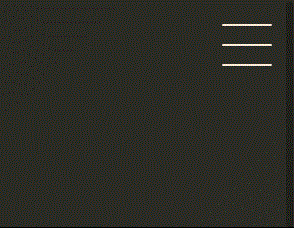

<!-- markdownlint-disable MD033 -->
# dio-projeto-portfolio

A simple project proposed by **DIO** in the HTML and CSS module from the **TQI Bootcamp**.

Here we can see some effects made completely using CSS:

 

- Linear gradient animation

 

- Cards on hover animation

 

- Menu effect

 

## New Features

After that I decided to implement a simple javascript to disable the menu when the user click anywhere on the screen or when some menu item is selected.

